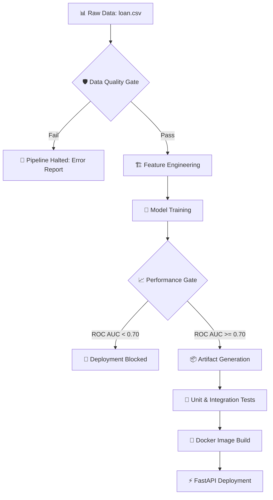

# 🛡️ RISKLOCK: Governed Loan Risk Prediction

<p align="center">
  
  
  
  
</p>

---

## 📖 Overview

**RISKLOCK** is a production-grade, end-to-end Machine Learning ecosystem designed for **Loan Default Prediction**. It bridges the gap between experimental data science and mission-critical financial engineering. Unlike standard ML scripts, RISKLOCK enforces strict **Data Quality Gating**, **Model Governance**, and **Automated CI/CD** to ensure that only verified, high-performance models reach production.

### 🔄 The RISKLOCK Lifecycle



---

## 🚀 Key Features

*   **🛡️ Policy-Driven Quality Gating**: Automated validation of missing rates, class imbalance, and financial sanity. If the data is "garbage," the pipeline stops before wasting training resources.
*   **🏗️ Modular Architecture**: Clean separation of concerns between `core/` (ML logic) and `app/` (serving logic).
*   **⚡ Intelligent Inference**: A FastAPI service that handles real-world "messy" inputs (e.g., `"12.5%"` or `"10+ years"`) using robust normalization logic.
*   **🤖 Full CI/CD Automation**: GitHub Actions workflow that executes the entire pipeline—from quality checks to Docker builds—on every commit.
*   **📦 Reproducible Environments**: Industry-standard Dockerization for consistent behavior across development, staging, and production.

---

## 📂 Project Structure

```text
.
├── .github/workflows/   # 🤖 CI/CD Automation
├── app/                 # ⚡ FastAPI Inference Service
│   ├── main.py          # API Entrypoint
│   ├── predict.py       # Inference & Normalization
│   └── schemas.py       # Pydantic Data Contracts
├── core/                # 🏗️ ML Pipeline Core
│   ├── data_quality.py  # Quality & Policy Gating
│   ├── evaluate.py      # Performance Validation
│   ├── features.py      # Feature Engineering Engine
│   ├── ingestion.py     # Data Loading Logic
│   └── train.py         # Model Training & Artifacts
├── artifacts/           # 📦 Models, Metrics & Metadata
├── Data/Raw/            # 📊 Training Dataset
├── tests/               # 🧪 Automated Test Suite
├── Dockerfile           # 🐳 Container Configuration
└── requirements.txt     # 📋 Dependencies
```

---

## 🛠️ Installation & Setup

### 1. Prerequisites
*   Python 3.12+
*   Docker Desktop (for containerization)

### 2. Quick Start
```bash
# Clone the repository
git clone https://github.com/PritamSanagapalli/RISKLOCK.git
cd RISKLOCK

# Set up virtual environment
python -m venv venv
source venv/bin/activate  # Windows: venv\Scripts\activate

# Install dependencies
pip install -r requirements.txt
```

---

## 🏎️ Running the Pipeline

RISKLOCK is built as a series of gated modules. You can run them manually or let the CI/CD handle it.

| Step | Command | Description |
| :--- | :--- | :--- |
| **1. Quality** | `python -m core.data_quality` | Validates data schema & financial sanity. |
| **2. Train** | `python -m core.train` | Trains the model & saves artifacts. |
| **3. Evaluate** | `python -m core.evaluate` | Enforces performance thresholds (ROC AUC > 0.70). |
| **4. Test** | `pytest` | Runs unit tests for API and Pipeline. |

---

## 🌐 API & Deployment

### 🐳 Run with Docker (Recommended)
```bash
docker build -t risklock:latest .
docker run -p 8000:8000 risklock:latest
```

### ⚡ Run Locally
```bash
uvicorn app.main:app --reload
```
Interactive Documentation: [http://localhost:8000/docs](http://localhost:8000/docs)

### 🧪 Sample API Request
```bash
curl -X POST http://localhost:8000/predict \
  -H "Content-Type: application/json" \
  -d '{
    "loan_amnt": 15000.0,
    "annual_inc": 75000.0,
    "int_rate": "14.2%",
    "emp_length": "5 years",
    "dti": 18.5,
    "earliest_cr_line": "Jan-2015",
    "term": " 36 months",
    "home_ownership": "RENT"
  }'
```

---

## 🤖 Automated CI/CD

Every push to `main` triggers a high-integrity workflow:
1.  **Linting & Hygiene**: Checks for code standards.
2.  **Data Quality Gate**: Ensures the latest data is valid.
3.  **Retraining**: Updates the model with the latest dataset.
4.  **Evaluation Gate**: Prevents deployment if the new model's ROC AUC drops below 0.70.
5.  **Unit Testing**: Runs the full test suite.
6.  **Docker Build**: Creates a production-ready image.

---

## 👨‍💻 Author

**Pritam Sanagapalli**
*   GitHub: [@PritamSanagapalli](https://github.com/PritamSanagapalli)
*   Portfolio: [https://github.com/PritamSanagapalli](https://github.com/PritamSanagapalli)

---

## 📄 License
This project is licensed under the MIT License - see the [LICENSE](LICENSE) file for details.
