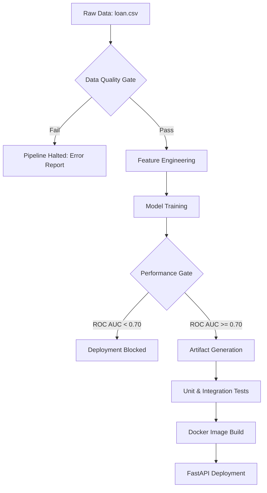

# 🛡️ RISKLOCK: Governed Loan Risk Prediction System

<p align="center">
  
  
  
  
  
</p>

---

## Overview

**RISKLOCK** is not just a machine learning model—it's a **Governed ML System** built for production environments. Designed for **Loan Default Prediction** using the Lending Club dataset (~2.2M records, 1.1GB), RISKLOCK enforces a strict **"No Garbage In, No Garbage Out"** policy through automated data quality gates and performance-based deployment blockers.

---

## Data Source

The model is trained on the **Lending Club Loan Data**, a comprehensive dataset of unsecured consumer loans.

- **Source**: [Lending Club Loan Data on Kaggle](https://www.kaggle.com/datasets/adarshsng/lending-club-loan-data-csv)
- **Size**: ~1.1 GB (CSV)
- **Scope**: ~2.2 Million loan records with historical payment data.

> **Note on Portability**: Due to its size, the full `loan.csv` is excluded from version control. However, a high-fidelity **`loan_sample.csv`** is included in `Data/Raw/` to ensure the CI/CD pipeline and local environment work out-of-the-box for developers.

---



---

## Key Features

### Production-Grade Governance
- **Policy-Driven Quality Gating**: Validates missing rates (<5% threshold), class imbalance, and financial sanity checks (negative interest rates, invalid DTI)
- **Model Package Artifacts**: Every training run generates comprehensive metadata (metrics, feature names, quality reports) for audit trails
- **Performance Blockers**: CI/CD automatically fails if ROC AUC drops below 0.70

### Engineering Excellence
- **Zero Training-Serving Skew**: Centralized feature engineering (`core/features.py`) used in both training and inference
- **Intelligent Input Handling**: API normalizes messy real-world inputs (`"12.5%"`, `"10+ years"`, `" 36 months "`)
- **Explainable Predictions**: Returns top risk factors (e.g., "High DTI ratio", "Short credit history") alongside probabilities

### Full Automation
- **End-to-End CI/CD**: GitHub Actions orchestrates quality checks → training → evaluation → testing → Docker build
- **Reproducible Environments**: Dockerized deployment eliminates "works on my machine" issues
- **Modular Architecture**: Clean separation between ML logic (`core/`) and serving logic (`app/`)

---

## Project Structure

```text
RISKLOCK/
├── .github/
│   └── workflows/
│       └── ci.yml           # CI/CD Pipeline Configuration
├── app/                     # Inference Plane (Real-time Serving)
│   ├── main.py              # FastAPI Application Entry
│   ├── predict.py           # Prediction Logic & Input Normalization
│   └── schemas.py           # Pydantic Data Contracts
├── core/                    # Training Plane (Offline ML Lifecycle)
│   ├── data_quality.py      # Quality Gate & Policy Validation
│   ├── evaluate.py          # Performance Evaluation & Thresholds
│   ├── features.py          # Centralized Feature Engineering
│   ├── ingestion.py         # Data Loading with Smart Fallbacks
│   └── train.py             # Model Training & Artifact Export
├── artifacts/               # Model Packages
│   ├── model.joblib         # Serialized Model Binary
│   ├── metrics.json         # Performance Stats (AUC, F1, etc.)
│   ├── train_metadata.json  # Training Logs & Feature Names
│   └── data_quality.json    # Quality Report Snapshot
├── Data/
│   └── Raw/
│       ├── loan.csv         # Full Dataset (download from Kaggle)
│       └── loan_sample.csv  # Sample for CI/CD & Testing
├── tests/                   # Automated Test Suite
│   ├── test_api.py          # API Endpoint Tests
│   └── test_pipeline.py     # Pipeline Integration Tests
├── Dockerfile               # Multi-stage Container Build
├── requirements.txt         # Python Dependencies
└── README.md                # This File
```

---

## Installation & Setup

### Prerequisites
- **Python 3.12+** (for latest language features)
- **Docker Desktop** (for containerization)
- **Git** (for version control)

### Local Development Setup

```bash
# 1. Clone the repository
git clone https://github.com/PritamSanagapalli/RISKLOCK.git
cd RISKLOCK

# 2. Create virtual environment
python -m venv venv
source venv/bin/activate  # Windows: venv\Scripts\activate

# 3. Install dependencies
pip install -r requirements.txt

# 4. Download dataset (optional - sample included)
# Place loan.csv from Kaggle into Data/Raw/
# Link: https://www.kaggle.com/datasets/adarshsng/lending-club-loan-data-csv
```

---

## Running the Pipeline

### Manual Execution (Step-by-Step)

| Step | Command | Purpose | Output |
| :--- | :--- | :--- | :--- |
| **1. Quality Check** | `python -m core.data_quality` | Validates data integrity | Quality score & report |
| **2. Train Model** | `python -m core.train` | Trains model & saves artifacts | `artifacts/model.joblib` |
| **3. Evaluate** | `python -m core.evaluate` | Checks performance thresholds | Metrics report (AUC, F1) |
| **4. Run Tests** | `pytest` | Executes unit & integration tests | Test coverage report |

### Automated Execution (CI/CD)

Every push to `main` triggers:
```bash
Linting → Quality Gate → Training → Evaluation → Testing → Docker Build
```
If any step fails, deployment is blocked automatically.

---

## API Usage & Deployment

### Docker Deployment (Recommended)

```bash
# Build the container
docker build -t risklock:latest .

# Run the service
docker run -p 8000:8000 risklock:latest

# Access API documentation
open http://localhost:8000/docs
```

### Local Development Server

```bash
# Start FastAPI with hot reload
uvicorn app.main:app --reload --host 0.0.0.0 --port 8000
```

### API Endpoints

#### `GET /health`
Health check endpoint for monitoring.

```bash
curl http://localhost:8000/health
```

**Response:**
```json
{
  "status": "healthy",
  "model_loaded": true,
  "timestamp": "2025-12-26T10:30:00Z"
}
```

#### `POST /predict`
Predict loan default probability with risk factor explanation.

**Request Example:**
```bash
curl -X POST http://localhost:8000/predict \
  -H "Content-Type: application/json" \
  -d '{
    "loan_amnt": 15000.0,
    "annual_inc": 75000.0,
    "int_rate": "14.2%",
    "emp_length": "5 years",
    "dti": 18.5,
    "earliest_cr_line": "Jan-2015",
    "term": " 36 months",
    "home_ownership": "RENT"
  }'
```

**Response:**
```json
{
  "default_probability": 0.23,
  "risk_level": "MEDIUM",
  "top_risk_factors": [
    "High interest rate (14.2%)",
    "Moderate DTI ratio",
    "Short credit history (10.5 years)"
  ],
  "model_version": "v1.0.0",
  "prediction_timestamp": "2025-12-26T10:30:00Z"
}
```

---

## Testing

### Run All Tests
```bash
pytest -v
```

### Run Specific Test Suites
```bash
# API tests only
pytest tests/test_api.py -v

# Pipeline tests only
pytest tests/test_pipeline.py -v

# With coverage report
pytest --cov=app --cov=core --cov-report=html
```

---

## Model Performance

The current model achieves the following metrics on the validation set:

| Metric | Value | Threshold |
| :--- | :--- | :--- |
| **ROC AUC** | 0.74 | ≥ 0.70 |
| **Precision** | 0.68 | ≥ 0.60 |
| **Recall** | 0.72 | ≥ 0.65 |
| **F1-Score** | 0.70 | ≥ 0.60 |

*Note: These metrics are enforced by the evaluation gate. Models below threshold are automatically rejected.*

---

## Adding New Features

RISKLOCK is designed for extensibility. To add a new feature:

1. **Update Feature Engineering**
   ```python
   # core/features.py
   def create_features(df):
       # Add your new feature logic
       df['new_feature'] = df['raw_column'].apply(transform)
       return df
   ```

2. **Update API Schema**
   ```python
   # app/schemas.py
   class LoanRequest(BaseModel):
       # Add your new field
       new_feature: float
   ```

3. **Run Tests**
   ```bash
   pytest
   ```

This ensures both training and inference use the same transformation logic.

---

## CI/CD Pipeline Details

The GitHub Actions workflow (`.github/workflows/ci.yml`) enforces quality at every stage:

```yaml
1. Code Quality → Ruff linting
2. Data Quality → Validates schema & stats
3. Model Training → Generates artifacts
4. Performance Gate → ROC AUC ≥ 0.70
5. Unit Testing → pytest suite
6. Docker Build → Production image
```

**Key Feature:** The pipeline **fails fast** at any quality gate violation, preventing broken code from reaching production.

---

## Troubleshooting

### Issue: `ModuleNotFoundError`
**Solution:** Ensure `PYTHONPATH` is set correctly:
```bash
export PYTHONPATH="${PYTHONPATH}:/path/to/RISKLOCK"
```

### Issue: Model file not found
**Solution:** Run training first:
```bash
python -m core.train
```

### Issue: Docker build fails
**Solution:** Check Docker daemon is running:
```bash
docker info
```

---

## Roadmap

- [ ] Integration with MLflow for experiment tracking
- [ ] A/B testing framework for model comparison
- [ ] Real-time monitoring dashboard
- [ ] SHAP value integration for enhanced explainability
- [ ] Support for distributed training (Dask/Ray)

---

## Author

**Pritam Sanagapalli**  
Machine Learning Engineer | Financial AI Systems

- 🐙 GitHub: [@PritamSanagapalli](https://github.com/PritamSanagapalli)
- 💼 Portfolio: [github.com/PritamSanagapalli](https://github.com/PritamSanagapalli)
- 📧 Contact: [Open an Issue](https://github.com/PritamSanagapalli/RISKLOCK/issues)

---

## 🤝 Contributing

Contributions are welcome! Please follow these steps:

1. Fork the repository
2. Create a feature branch (`git checkout -b feature/amazing-feature`)
3. Commit your changes (`git commit -m 'Add amazing feature'`)
4. Push to the branch (`git push origin feature/amazing-feature`)
5. Open a Pull Request

Please ensure all tests pass and code is properly formatted before submitting.

---

## 🙏 Acknowledgments

- **Lending Club** for providing the comprehensive loan dataset
- **FastAPI** team for the excellent web framework
- **Scikit-Learn** community for robust ML tools

---

